# Resolution flow: `search` → installed

A maintainer's map of the interactive shell's control flow, from the search box
to an installed package. The load-bearing property it encodes:

> **The cart holds the *resolved* transaction.** The whole cart is resolved and
> conflict-checked the moment you `add`, and the plan is **frozen into the
> cart**. `show` renders that frozen plan; `apply` executes it with **no
> re-resolution**; `refresh` drops the cart, because the DBs it was resolved
> against just moved.

This is why the provenance you pick at `add` (e.g. the `extra/webp-pixbuf-loader`
row over an unrelated AUR namesake) can't be silently re-derived into something
else at `apply` — `apply` never re-derives.

```mermaid
flowchart TD
  subgraph SHELL["① SHELL · you drive the session"]
    direction TB
    s(["search webp-pixbuf-loader"]):::user --> res["numbered results —<br/>sync-repo rows + AUR rows"]:::info
    res --> a(["add 1  ·  pick rows by number"]):::user
    a --> pk{"a numbered row,<br/>or a typed name?"}:::dec
    pk -->|"numbered row"| stgP["stage — pin<br/>the row's source"]:::info
    pk -->|"typed name / glob"| stgC["stage — classify<br/>the bare name"]:::info
  end

  stgP --> R
  stgC --> R

  subgraph RES["② RESOLVE — the whole cart, at ADD (never at apply)"]
    direction TB
    R["expand + classify every staged root<br/>· one classify_full pass, honoring pins"]:::eng
    R --> pin2{"did the picked row<br/>pin a source?"}:::dec
    pin2 -->|"repo pin"| goS["repo lane"]:::hop
    pin2 -->|"AUR pin"| goB["build lane"]:::hop
    pin2 -->|"no pin"| own{"does pacman<br/>own the name?"}:::dec
    own -->|"yes"| fgn{"installed foreign AUR pkg,<br/>named directly?"}:::dec
    fgn -->|"no"| goS
    fgn -->|"yes · rebuild"| goB
    own -->|"no"| ina{"in the AUR<br/>index?"}:::dec
    ina -->|"yes"| goB
    ina -->|"no"| mss["✗ reject — missing;<br/>cart rolled back"]:::stop
    goS --> cflict{"declared conflict among<br/>staged + installed?<br/>(no matching replaces=)"}:::dec
    goB --> cflict
    cflict -->|"yes"| rej["✗ reject — conflict;<br/>cart rolled back"]:::stop
    cflict -->|"no"| freeze["freeze the resolved plan<br/>into the cart  ✎"]:::eng
  end

  freeze --> crt["cart = the fully-resolved,<br/>conflict-free transaction"]:::info
  crt --> nr{"an AUR item<br/>not yet reviewed?"}:::dec
  nr -->|"yes"| rv(["review / approve —<br/>read the PKGBUILD"]):::user
  nr -->|"no · repo or approved"| shw
  rv --> shw(["show — render the FROZEN plan<br/>· no re-resolve"]):::user
  shw -->|"refresh · DBs move"| drop["✗ cart dropped —<br/>the frozen plan is stale"]:::stop
  shw --> ap(["apply"]):::user

  subgraph EXE["③ APPLY — execute the frozen plan · NO resolution"]
    direction TB
    ap --> g{"anything still<br/>unreviewed?"}:::dec
    g -->|"yes"| refuse["✗ refused —<br/>needs review"]:::stop
    g -->|"no"| syg{"sysupgrade gate — will the<br/>repo upgrade break something?"}:::dec
    syg -->|"declined override"| abort["✗ declined"]:::stop
    syg -->|"clear / accepted"| ex["execute, in order:<br/>AUR blockers  →  repo pacman -Su --dbpath synced<br/>→  main AUR makepkg + pacman -U  →  removals"]:::act
  end

  ex --> okR["repo pkgs installed<br/>from the synced db ✔"]:::done
  ex --> okA["AUR pkgs built<br/>&amp; installed ✔"]:::done

  classDef user fill:#1c1830,stroke:#9d8cf5,stroke-width:1.6px,color:#e4ddff;
  classDef info fill:#141a22,stroke:#38465a,color:#c3cdda;
  classDef dec fill:#182029,stroke:#6b7d95,color:#dbe3ee;
  classDef eng fill:#10302d,stroke:#5fc7ba,stroke-width:2px,color:#cdeee9;
  classDef act fill:#2a2110,stroke:#e6a95c,stroke-width:1.6px,color:#f3d9b3;
  classDef done fill:#122a1b,stroke:#67c98a,stroke-width:1.6px,color:#c7efd6;
  classDef stop fill:#2a1618,stroke:#e5776f,stroke-width:1.4px,color:#f2c9c5;
  classDef hop fill:none,stroke:none,color:#7f8ea3;
```



## The decision points

Keyed to the diamonds and the amber action above; each names the code that
owns it.

### ② Resolve — runs during `add`/`upgrade`/`drop` (`ShellEnv::stage_plan`)

- **A numbered row, or a typed name?** — `add 1` pins the picked row's source
  (repo or AUR); a hand-typed name/glob has no row to speak for it and is
  classified fresh (pacman first, then AUR). (`staging.rs`)
- **Did the picked row pin a source?** — the pin carried from the row overrides
  pacman precedence. It's why picking the `extra/webp-pixbuf-loader` row installs
  that, not an unrelated AUR namesake. (`resolver::resolve_target_source`)
- **Does pacman own the name?** — installed locally, or an exact/virtual name in
  a sync repo. A name pacman can satisfy never routes through the AUR, even if
  the AUR has its own copy (yay/paru convention).
- **Installed foreign AUR pkg, named directly?** — the `is_foreign` gate: an
  installed AUR (foreign) package you named directly rebuilds from the AUR, even
  though pacman "owns" the name. `classify` can't see versions; this gate is the
  `webp-pixbuf-loader` fix — an installed *repo* package with an AUR namesake
  stays on the repo lane; a genuinely foreign one rebuilds.
  (`pacman::alpm_db::is_foreign`)
- **In the AUR index?** — found by pkgname, a `provides`, or pkgbase. Nowhere
  → the target is missing and the whole `add` is rejected (the cart rolls back).
- **Declared conflict among staged + installed?** — the resolved set is checked
  for a staged AUR package that declares `conflicts=X` on a co-present `X`
  (another staged package, or an installed one not being removed) with no
  matching `replaces=X`. pacman would refuse this at prepare — *after* the build
  — so catching it here makes "a cart with conflicting items is impossible."
  (`resolver::conflict::check`)
- **Freeze the plan into the cart** — the resolved plans (build strata, the
  partial `-Su` selection, the sysupgrade verdict, the synced size snapshot) are
  stored in the cart behind an `Rc`. `show` renders *this* and `apply` executes
  *this*; `undo` snapshots it together with the roots.
  (`cart::Cart::set_resolution`, `shell::resolved::ResolvedCart`)

### The approval gate

- **An AUR item not yet reviewed?** — a sync-repo package auto-approves (pacman
  owns it); an AUR package carries a PKGBUILD you must read, unless
  `aur_approval = auto`.
- **show** reads the stored resolution and prints the change-set table — no I/O,
  no re-resolve. `approve`/`review` only flip an approval cell, so they reflect
  on the next `show` without re-resolving.
- **refresh drops the cart** — a `refresh` re-fetches the mirror + sync DBs, so
  the frozen plan was resolved against data that just moved; aurox drops the
  whole cart rather than apply a stale transaction. Refresh is the **only** point
  the DBs move between `add` and `apply` — which is exactly what keeps the frozen
  plan valid the rest of the time. (`shell::State::refresh`)

### ③ Apply — executes the frozen plan (`RealEnv::apply`)

- **Anything still unreviewed?** — `apply` refuses to run while any staged AUR
  item is unreviewed; you can't build code you haven't looked at.
- **Sysupgrade gate** — consumption only: the breakage was *detected* at `add`
  (frozen notes + a `Clear`/`NeedsOverride` verdict — `resolved::PreflightGate`).
  Here `apply` only prints the frozen notes and asks the override when unresolved
  breakage remains; a staged AUR rebuild that fixes the break is simply ordered
  first.
- **Execute the frozen plan** — no resolution: install the AUR sysupgrade
  blockers first, then the repo upgrade via `pacman -Su --dbpath <synced>` (the
  versions frozen at `add`, not a fresh `-Sy`), then build + `pacman -U` the main
  AUR half, then `pacman -R` the removals. (`dispatch::run_repo_upgrade`,
  `build::InstallCtx::apply_plan`)

---

This doc is the GitHub-rendered source of record. The diagram is also generated
(from the ```mermaid``` block above, rendered then optimized) as a standalone,
dark-themed [`resolution-flow.svg`](resolution-flow.svg) you can open directly;
[`resolution-flow.html`](resolution-flow.html) frames that SVG with the
hover-detail bubbles — hover any diamond, the resolve engine, or the amber
action (serve the folder, e.g. `python3 -m http.server`, or view via GitHub
Pages, so the bubbles can read the embedded SVG).
